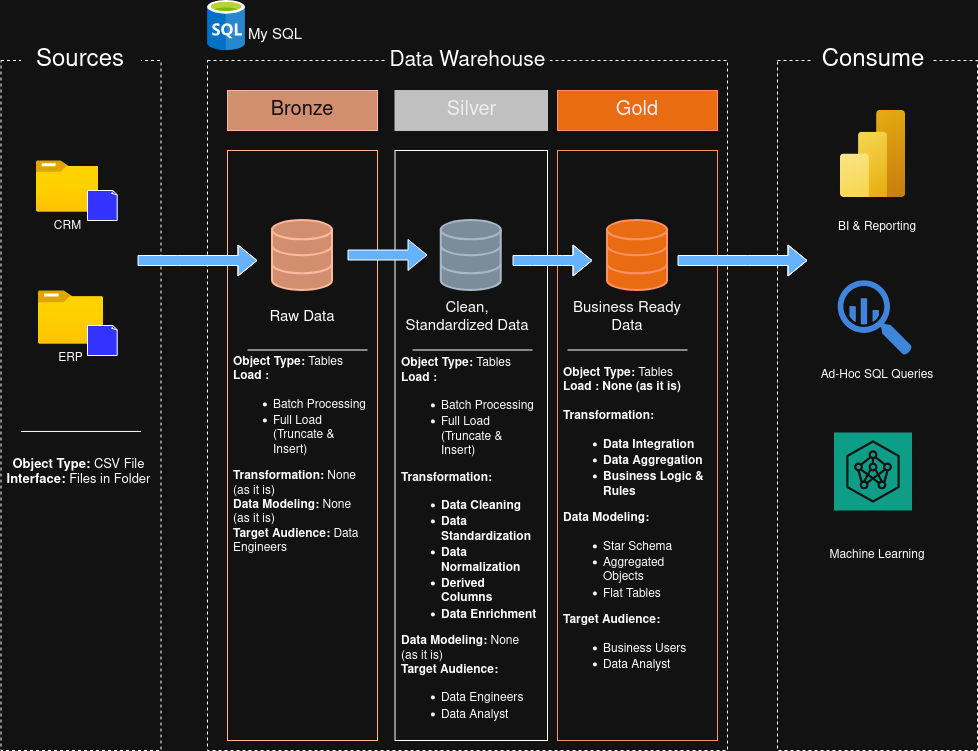
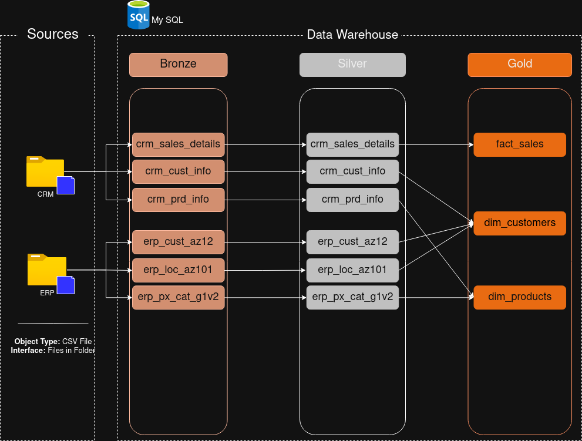
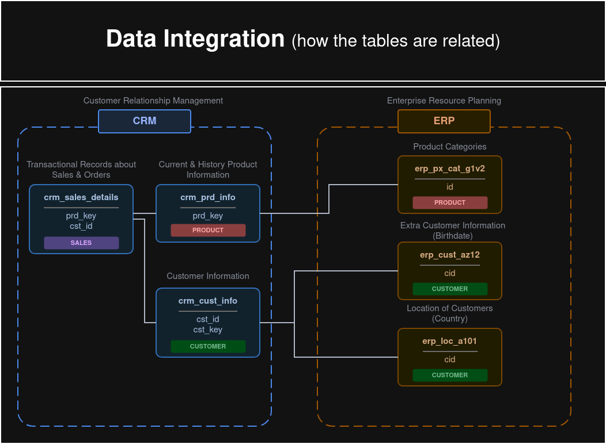
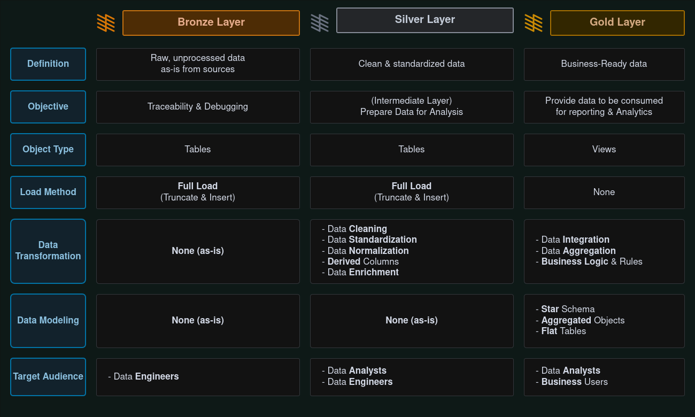
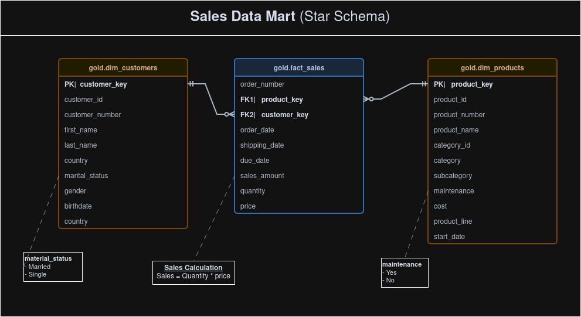

# 🏢 Sales SQL Data Warehouse and EDA

<div align="center">

[](https://www.mysql.com/)
[](https://en.wikipedia.org/wiki/SQL)
[](https://en.wikipedia.org/wiki/Data_warehouse)
[](https://www.databricks.com/glossary/medallion-architecture)
[](https://en.wikipedia.org/wiki/Star_schema)

**A modern, enterprise-grade data warehouse solution for sales analytics and business intelligence built with MySQL.**

[Getting Started](#-getting-started) • [Architecture](#-data-architecture) • [Documentation](#-documentation) • [Analytics](#-exploratory-data-analysis--reports) • [Credits](#-credits)

</div>

---

## 📋 Table of Contents

- [Project Overview](#-project-overview)
- [Data Architecture](#-data-architecture)
- [Project Structure](#-project-structure)
- [Data Sources](#-data-sources)
- [ETL Pipeline](#-etl-pipeline)
- [Data Modeling](#-data-modeling)
- [Exploratory Data Analysis & Advanced Analytics](#-exploratory-data-analysis--advanced-analytics)
- [Skills Demonstrated](#-skills-demonstrated)
- [Credits](#-credits)
- [Getting Started](#-getting-started)
- [Key Features](#-key-features)
- [Documentation](#-documentation)
- [Performance Optimization](#-performance-optimization)
- [Future Enhancements](#-future-enhancements)
- [Contributing](#-contributing)
- [License](#-license)
- [Contact](#-contact)

---

## 🎯 Project Overview

This project demonstrates the end-to-end development of a **modern data warehouse** using **MySQL**, designed to consolidate disparate sales data into a unified, analytics-ready platform. By implementing the **Medallion Architecture** (Bronze → Silver → Gold layers) and transforming raw operational data from multiple source systems into structured dimensional models, this warehouse enables high-performance business intelligence, trend analysis, and data-driven decision-making.

> **⭐ For Recruiters:** This repository showcases production-ready data warehousing skills including ETL development, dimensional modeling, advanced SQL analytics (window functions, CTEs, complex JOINs), and comprehensive business intelligence capabilities. The project includes **12 progressive EDA scripts** demonstrating real-world analytical techniques from basic KPIs to advanced customer segmentation and time-series analysis. See the [Skills Demonstrated](#-skills-demonstrated) section for a complete overview.

### 🎯 Objectives

- **Centralize** sales data from multiple operational systems (ERP & CRM) into a single source of truth
- **Cleanse & Standardize** raw data to ensure quality, consistency, and reliability
- **Transform** data progressively through Bronze, Silver, and Gold layers following best practices
- **Model** data using industry-standard **Star Schema** optimized for analytical workloads
- **Enable** comprehensive exploratory data analysis with pre-built analytical queries
- **Deliver** actionable insights into customer behavior, product performance, and sales trends through business-ready reports

### 📊 Project Highlights

| Dimension | Details |
|-----------|---------|
| **Architecture** | 3-tier Medallion (Bronze/Silver/Gold) with Star Schema dimensional model |
| **Data Volume** | 18,000+ customers, 500+ products, 60,000+ sales transactions |
| **SQL Scripts** | 25+ modular scripts organized by layer and function |
| **EDA Suite** | 12 progressive analytical scripts covering 10+ analytical techniques |
| **Analytics** | Customer segmentation, product performance, time-series trends, KPI dashboards |
| **SQL Techniques** | Window functions, CTEs, complex JOINs, date intelligence, business logic |
| **Documentation** | Complete data catalog, naming conventions, architecture diagrams |

---

## 🏗️ Data Architecture

The warehouse follows the **Medallion Architecture** pattern, organizing data into three distinct layers that progressively increase in quality and business value.

<div align="center">


*Figure 1: High-level Medallion Architecture showing data flow from source systems through Bronze, Silver, and Gold layers.*

</div>

### 🥉 Bronze Layer — Raw Data Ingestion

- **Purpose:** Landing zone for raw, unmodified data from source systems
- **Characteristics:**
  - Data ingested "as-is" from CSV exports
  - Preserves original source structure and granularity
  - Acts as the historical archive and single source of truth
  - Minimal transformations (only type casting if necessary)

### 🥈 Silver Layer — Cleansed & Integrated

- **Purpose:** Data cleansing, standardization, and integration
- **Characteristics:**
  - Handles data quality issues (nulls, duplicates, invalid formats)
  - Standardizes naming conventions, date formats, and categorical values
  - Merges related datasets from ERP and CRM systems
  - Applies business rules and derived calculations
  - Removes or quarantines anomalous records

### 🥇 Gold Layer — Business-Ready Analytics

- **Purpose:** Curated, business-level data models for reporting and analytics
- **Characteristics:**
  - Dimensional modeling using **Star Schema** (dimensions + facts)
  - Implemented as **views** (not tables) for real-time data access
  - Optimized for fast analytical queries and BI tool consumption
  - Contains fully integrated and enriched datasets
  - Serves as the primary interface for analysts and business users
  - Includes surrogate keys for dimension tables

<div align="center">


*Figure 2: Detailed data flow diagram showing ETL processes between architecture layers.*

</div>

---

## 📂 Project Structure

```text
Sales_SQL_DataWarehouse/
│
├── 📁 Datasets/                          # Raw source data files (CSV)
│   ├── source_crm/                       # Customer Relationship Management data
│   │   ├── cust_info.csv                 # Customer information
│   │   ├── prd_info.csv                  # Product information
│   │   └── sales_details.csv             # Sales transaction details
│   └── source_erp/                       # Enterprise Resource Planning data
│       ├── CUST_AZ12.csv                 # Extended customer attributes
│       ├── LOC_A101.csv                  # Geographic location data
│       └── PX_CAT_G1V2.csv               # Product categorization data
│
├── 📁 Docs/                              # Project documentation & diagrams
│   ├── DataArchitecture.png              # High-level architecture visualization
│   ├── DataFlow.png                      # ETL process visualization
│   ├── DataLayers.png                    # Layer transformation visualization
│   ├── DataModel.png                     # Star schema dimensional model
│   ├── Data_Integration.png              # Data source integration mapping
│   ├── Data_Catalog.md                   # Complete data dictionary and metadata
│   └── Naming_Conventions.md             # Standard naming guidelines
│
├── 📁 Scripts/                           # SQL scripts organized by function
│   ├── 📁 DataWarehouse/                 # Core ETL pipeline scripts
│   │   ├── init_database.sql             # Database initialization
│   │   ├── 🥉 Bronze/                    # Raw data ingestion layer
│   │   │   ├── create_schema.sql         # Bronze schema creation
│   │   │   ├── create_tables.sql         # Raw table definitions
│   │   │   └── load_data.sql             # Data loading from CSV files
│   │   ├── 🥈 Silver/                    # Data cleansing & integration layer
│   │   │   ├── create_schema.sql         # Silver schema creation
│   │   │   ├── create_tables.sql         # Cleaned table definitions
│   │   │   ├── clean_crm_cust_info.sql   # Customer data cleansing
│   │   │   ├── clean_crm_prd_info.sql    # Product data cleansing
│   │   │   ├── clean_crm_sales_details.sql # Sales data cleansing
│   │   │   ├── clean_erp_cust_az12.sql   # ERP customer data cleansing
│   │   │   ├── clean_erp_loc_az101.sql   # Location data cleansing
│   │   │   └── clean_erp_px_cat_g1v2.sql # Product category cleansing
│   │   └── 🥇 Gold/                      # Business-ready dimensional layer
│   │       ├── create_schema.sql         # Gold schema creation
│   │       ├── create_views.sql          # Dimensional model views (dim + fact)
│   │       └── validate_integrity.sql    # Data quality validation
│   └── 📁 EDA/                           # Exploratory Data Analysis
│       ├── 01_setup.sql                  # Analytics schema setup
│       ├── 02_metadata_exploration.sql   # Data profiling and metadata analysis
│       ├── 03_dimension_exploration.sql  # Dimensional analysis
│       ├── 04_measure_exploration.sql    # Metric exploration
│       ├── 05_magnitude_analysis.sql     # Volume and size analysis
│       ├── 06_ranking_analysis.sql       # Top/bottom performers
│       ├── 07_change_over_time.sql       # Temporal trend analysis
│       ├── 08_cumulative_analysis.sql    # Running totals and cumulative metrics
│       ├── 09_performance_analysis.sql   # Performance metrics and KPIs
│       ├── 10_part_to_whole_analysis.sql # Composition and contribution analysis
│       ├── 11_data_segmentation.sql      # Customer and product segmentation
│       └── 12_reports.sql                # Consolidated business reports
│
├── 📄 README.md                          # Project documentation (this file)
├── 📄 LICENSE                            # MIT License
└── 📄 .gitignore                         # Git ignore rules
```

---

## 📊 Data Sources

This warehouse integrates data from two primary operational systems:

| Source System | Files | Description |
|--------------|-------|-------------|
| **CRM** | `cust_info.csv`, `prd_info.csv`, `sales_details.csv` | Customer profiles, product catalog, and transactional sales records |
| **ERP** | `CUST_AZ12.csv`, `LOC_A101.csv`, `PX_CAT_G1V2.csv` | Extended customer attributes, geographic locations, and product categorizations |

### Data Integration Strategy

<div align="center">


*Figure 3: Data integration mapping showing how CRM and ERP datasets are merged and enriched.*

</div>

---

## 🔄 ETL Pipeline

The Extract, Transform, Load (ETL) process is implemented entirely in **MySQL SQL**, ensuring optimal performance and maintainability within the MySQL ecosystem.

### Pipeline Architecture

The ETL pipeline follows the Medallion Architecture pattern with three progressive transformation stages:

```
Source Systems (CRM/ERP CSV) → Bronze Layer → Silver Layer → Gold Layer → Analytics
```

### Phase 1: Extract (Bronze Layer)

**Objective:** Ingest raw data as-is from source systems

```sql
-- Example: Loading raw CRM customer data into Bronze layer
LOAD DATA LOCAL INFILE 'Datasets/source_crm/cust_info.csv'
INTO TABLE bronze.crm_cust_info
FIELDS TERMINATED BY ',' 
ENCLOSED BY '"'
LINES TERMINATED BY '\n'
IGNORE 1 ROWS;
```

**Characteristics:**
- Full load strategy (Truncate & Insert)
- No transformations applied
- Preserves data lineage and audit trail
- Serves as the source of truth for debugging

### Phase 2: Transform (Silver Layer)

**Objective:** Cleanse, standardize, and integrate data from multiple sources

**Transformation Operations:**
- **Cleansing:** Remove duplicates, handle NULL values, standardize formats
- **Validation:** Apply data quality rules and constraints
- **Standardization:** Normalize date formats, categorical values, naming conventions
- **Integration:** Merge related datasets from CRM and ERP systems
- **Enrichment:** Calculate derived fields (age, product hierarchies, etc.)
- **Deduplication:** Identify and resolve duplicate records

```sql
-- Example: Cleaning and transforming customer data
INSERT INTO silver.crm_cust_info
SELECT 
    customer_id,
    TRIM(UPPER(customer_number)) AS customer_number,
    TRIM(first_name) AS first_name,
    TRIM(last_name) AS last_name,
    COALESCE(country, 'Unknown') AS country,
    STR_TO_DATE(birthdate, '%Y-%m-%d') AS birthdate,
    CURRENT_TIMESTAMP AS dwh_load_date
FROM bronze.crm_cust_info
WHERE customer_id IS NOT NULL;
```

### Phase 3: Load (Gold Layer)

**Objective:** Create business-ready dimensional model using Star Schema

**Implementation Strategy:**
- Dimensional tables implemented as **views** (not physical tables)
- Real-time data refresh from Silver layer
- Surrogate keys generated for dimension tables
- Foreign key relationships established between facts and dimensions

```sql
-- Example: Creating dimension view with surrogate keys
CREATE OR REPLACE VIEW gold.dim_customers AS
SELECT 
    ROW_NUMBER() OVER (ORDER BY customer_id) AS customer_key,
    customer_id,
    customer_number,
    first_name,
    last_name,
    country,
    marital_status,
    gender,
    birthdate,
    create_date
FROM silver.crm_cust_info;
```

**Load Methods:**
- **Dimension Tables:** SCD Type 1 (overwrite) for current state
- **Fact Tables:** Incremental append for transactional data
- **Views:** Real-time materialization from Silver layer

<div align="center">


*Figure 4: ETL pipeline workflow showing transformation logic between layers.*

</div>

---

## 🎲 Data Modeling

The Gold Layer implements a **Star Schema** optimized for OLAP (Online Analytical Processing) workloads.

<div align="center">


*Figure 5: Dimensional model (Star Schema) showing relationships between fact and dimension tables.*

</div>

### Dimension Tables

| Table | Description | Key Attributes | Records |
|-------|-------------|----------------|---------|
| **dim_customers** | Customer master data enriched with demographics | `customer_key` (PK), `customer_id`, `customer_number`, `first_name`, `last_name`, `country`, `marital_status`, `gender`, `birthdate`, `create_date` | ~18,000+ |
| **dim_products** | Product catalog with categories and pricing | `product_key` (PK), `product_id`, `product_number`, `product_name`, `category`, `subcategory`, `maintenance_required`, `cost`, `product_line`, `start_date` | ~500+ |

### Fact Table

| Table | Description | Measures | Dimensions |
|-------|-------------|----------|------------|
| **fact_sales** | Transactional sales records | `sales_amount`, `quantity`, `price` | `order_number`, `product_key` (FK), `customer_key` (FK), `order_date`, `shipping_date`, `due_date` |

### Schema Characteristics

- **Star Schema Design:** One central fact table surrounded by dimension tables
- **Surrogate Keys:** Auto-generated integer keys (`customer_key`, `product_key`) for optimal join performance
- **Foreign Key Relationships:** `fact_sales` references both dimension tables
- **Denormalized Dimensions:** Optimized for query performance over storage efficiency
- **View-Based Implementation:** Gold layer uses views for real-time data access
- **Date Dimensions:** Temporal attributes included in fact table for time-based analysis

### Naming Conventions

Following industry best practices documented in `Docs/Naming_Conventions.md`:

| Pattern | Usage | Example |
|---------|-------|---------|
| `dim_*` | Dimension tables | `dim_customers`, `dim_products` |
| `fact_*` | Fact tables | `fact_sales` |
| `*_key` | Surrogate keys | `customer_key`, `product_key` |
| `dwh_*` | Technical metadata columns | `dwh_load_date`, `dwh_source_system` |

---

## 📈 Exploratory Data Analysis & Advanced Analytics

The warehouse includes a **comprehensive EDA (Exploratory Data Analysis) suite** with **12 progressive analytical scripts** demonstrating advanced SQL capabilities and business intelligence techniques. This showcase represents industry-standard analytical frameworks used in professional data warehousing environments.

### 🎯 Analytics Maturity Framework

The EDA scripts follow a **structured analytical progression** from basic profiling to advanced business intelligence:

<div align="center">

| Phase | Script | Analytical Technique | Business Value | SQL Skills Demonstrated |
|-------|--------|---------------------|----------------|------------------------|
| **🔍 Discovery** | **01_setup.sql** | Environment Setup | Analytics workspace initialization | Schema design, data loading |
| **📊 Profiling** | **02_metadata_exploration.sql** | Metadata Analysis | Database object discovery using `INFORMATION_SCHEMA` | System catalogs, metadata queries |
| **🎯 Descriptive** | **03_dimension_exploration.sql** | Dimension Analysis | Customer/product/date dimension exploration | Date functions, `TIMESTAMPDIFF`, aggregations |
| **📏 Measurement** | **04_measure_exploration.sql** | KPI Calculation | Core business metrics (revenue, volume, counts) | Aggregate functions, `DISTINCT`, KPI dashboard |
| **📐 Comparative** | **05_magnitude_analysis.sql** | Magnitude Comparison | Category-wise performance breakdown | `GROUP BY`, multi-table JOINs, hierarchical analysis |
| **🏆 Competitive** | **06_ranking_analysis.sql** | Top-N/Bottom-N Analysis | Best/worst performer identification | `LIMIT`, `ROW_NUMBER()`, window functions |
| **📈 Temporal** | **07_change_over_time.sql** | Trend & Seasonality | Time-series analysis, pattern detection | Date extraction, `YEAR()`, `MONTHNAME()`, time grouping |
| **⚡ Progressive** | **08_cumulative_analysis.sql** | Running Totals & Moving Averages | Growth tracking, momentum analysis | Window functions (`SUM/AVG OVER`), `PARTITION BY` |
| **⚔️ Benchmarking** | **09_performance_analysis.sql** | YoY/Average Comparisons | Target vs actual, period comparisons | `LAG()`, `CASE` logic, performance indicators |
| **🥧 Compositional** | **10_part_to_whole_analysis.sql** | Contribution Analysis | Market share, category contribution % | CTEs, window aggregations, percentage calculations |
| **🎪 Behavioral** | **11_data_segmentation.sql** | Customer/Product Segmentation | RFM-style segmentation, behavioral grouping | Complex `CASE` statements, range bucketing |
| **📋 Operational** | **12_reports.sql** | Business Reports | Consolidated customer/product analytics views | VIEWs, multi-metric calculations, derived KPIs |

</div>

### 💡 Advanced SQL Techniques Demonstrated

This EDA suite showcases professional-grade SQL expertise across multiple domains:

#### Window Functions & Analytical SQL
```sql
-- Running totals and moving averages (08_cumulative_analysis.sql)
SUM(total_sales) OVER(ORDER BY real_date) AS running_total,
AVG(average_price) OVER(PARTITION BY YEAR(real_date) ORDER BY real_date) AS moving_average_yearly

-- Year-over-Year comparison with LAG (09_performance_analysis.sql)
LAG(current_sales) OVER(PARTITION BY product_name ORDER BY order_year) AS previous_year_sales,
current_sales - LAG(current_sales) OVER(...) AS diff_py_sales

-- Ranking with ROW_NUMBER (06_ranking_analysis.sql)
ROW_NUMBER() OVER(ORDER BY SUM(sales_amount) DESC) AS rank_no
```

#### Common Table Expressions (CTEs)
```sql
-- Multi-level aggregation for contribution analysis (10_part_to_whole_analysis.sql)
WITH category_sales AS (
    SELECT category, SUM(sales_amount) AS total_sales
    FROM fact_sales JOIN dim_products USING(product_key)
    GROUP BY category
)
SELECT 
    category,
    CONCAT(ROUND((total_sales / SUM(total_sales) OVER()) * 100, 2), '%') AS contribution_pct
FROM category_sales;
```

#### Complex Business Logic
```sql
-- RFM-style customer segmentation (11_data_segmentation.sql)
CASE 
    WHEN lifespan >= 12 AND total_sales > 5000 THEN 'VIP'
    WHEN lifespan >= 12 AND total_sales <= 5000 THEN 'Regular'
    ELSE 'New'
END AS customer_rank

-- Multi-criteria performance indicators (09_performance_analysis.sql)
CASE 
    WHEN current_sales > average_sales THEN 'Above Average'
    WHEN current_sales < average_sales THEN 'Below Average'
    ELSE 'Average'
END AS performance_indicator
```

#### Date & Time Intelligence
```sql
-- Temporal range calculation (03_dimension_exploration.sql)
TIMESTAMPDIFF(YEAR, MIN(order_date), MAX(order_date)) AS order_range_years,
TIMESTAMPDIFF(MONTH, MIN(birthdate), NOW()) AS customer_age

-- Time-series grouping (07_change_over_time.sql)
DATE_FORMAT(order_date, '%M-%Y') AS order_period,
YEAR(order_date) AS order_year,
MONTHNAME(order_date) AS order_month
```

### 📊 Business Intelligence Outputs

#### 1. **Customer Analytics Dashboard** (`customer_report` view)

Comprehensive 360° customer view with advanced calculated metrics:

| Metric Category | KPIs Included | Analytical Technique |
|----------------|---------------|---------------------|
| **Demographics** | Age, Age Groups (Below 25, 25-39, 40-59, Above 60), Country | Demographic segmentation |
| **Behavioral Metrics** | Total Orders, Total Products Purchased, Quantity Purchased | Transaction aggregation |
| **Value Metrics** | Total Sales, Average Order Value (AOV), Average Monthly Spend | Revenue calculations |
| **Engagement Metrics** | Customer Lifespan (months), Recency (months since last purchase) | Temporal analysis |
| **Segmentation** | Customer Rank (VIP/Regular/New) based on lifespan + spend | RFM-style classification |

**Sample Insights Enabled:**
- "Identify VIP customers spending >€5,000 with 12+ months history"
- "Calculate customer lifetime value and purchase frequency"
- "Segment customers by age demographics and spending behavior"
- "Track customer retention using recency metrics"

```sql
-- Example: VIP customer identification
CASE 
    WHEN lifespan >= 12 AND total_sales > 5000 THEN 'VIP'
    WHEN lifespan >= 12 AND total_sales <= 5000 THEN 'Regular'
    ELSE 'New'
END AS customer_rank
```

#### 2. **Product Performance Analytics** (`product_report` view)

Complete product portfolio analysis with profitability and performance tiers:

| Metric Category | KPIs Included | Business Application |
|----------------|---------------|---------------------|
| **Product Attributes** | Product Name, Number, Category, Subcategory, Cost | Catalog management |
| **Sales Performance** | Total Orders, Total Sales, Quantity Sold | Revenue analysis |
| **Customer Reach** | Unique Customers, Market Penetration | Demand analysis |
| **Lifecycle Metrics** | Product Lifespan, Recency | Portfolio optimization |
| **Performance Tiers** | High Performer (>€50K), Mid Range (€10K-€50K), Low Performer (<€10K) | Strategic classification |
| **Revenue Metrics** | Average Order Revenue (AOR), Average Monthly Revenue | Forecasting inputs |

**Sample Insights Enabled:**
- "Identify top 10% revenue-generating products (High Performers)"
- "Analyze product portfolio health with lifespan and recency metrics"
- "Calculate average order revenue per product"
- "Compare product cost vs. sales performance"

```sql
-- Example: Performance tier classification
CASE 
    WHEN total_sales > 50000 THEN 'High Performer'
    WHEN total_sales >= 10000 THEN 'Mid Range'
    ELSE 'Low Performer'
END AS sales_performance
```

#### 3. **Executive KPI Dashboard**

Unified business metrics view combining dimensions and measures:

```sql
-- Real-time business health metrics (04_measure_exploration.sql)
SELECT 'Total Sales' AS metric, SUM(sales_amount) AS value FROM fact_sales
UNION ALL
SELECT 'Total Items Sold', SUM(quantity) FROM fact_sales
UNION ALL
SELECT 'Average Selling Price', AVG(price) FROM fact_sales
UNION ALL
SELECT 'Total Orders', COUNT(DISTINCT order_number) FROM fact_sales
UNION ALL
SELECT 'Active Customers', COUNT(DISTINCT customer_key) FROM fact_sales;
```

#### 4. **Advanced Analytical Capabilities**

| Analysis Type | Technique | Business Question Answered | Script Reference |
|--------------|-----------|---------------------------|------------------|
| **Trend Analysis** | YoY/MoM growth rates | "Is revenue growing or declining month-over-month?" | 07_change_over_time.sql |
| **Ranking Analysis** | Top-N/Bottom-N with window functions | "Who are our top 10 customers by revenue?" | 06_ranking_analysis.sql |
| **Contribution Analysis** | Part-to-whole percentages | "What % of revenue comes from each category?" | 10_part_to_whole_analysis.sql |
| **Cumulative Metrics** | Running totals, moving averages | "What is our cumulative revenue this quarter?" | 08_cumulative_analysis.sql |
| **Performance Benchmarking** | Current vs. previous/average | "How does this year compare to last year?" | 09_performance_analysis.sql |
| **Customer Segmentation** | RFM-based behavioral grouping | "How many VIP customers do we have?" | 11_data_segmentation.sql |
| **Magnitude Comparison** | Cross-category performance | "Which country generates the most revenue?" | 05_magnitude_analysis.sql |

### 🎯 Real-World Use Cases

Demonstrates solving actual business problems with SQL analytics:

| Business Question | Analytical Approach | SQL Technique | Output | Script |
|-------------------|---------------------|---------------|--------|--------|
| "Who are our most valuable customers?" | Customer lifetime value calculation + segmentation | Aggregations, `CASE`, behavioral grouping | VIP/Regular/New customer lists | 11, 12 |
| "Which products drive 80% of revenue?" | Pareto analysis (80/20 rule) | Part-to-whole %, cumulative sums | Top product contributors | 06, 10 |
| "Is our business growing or declining?" | Time-series trend analysis | Year-over-year comparisons, running totals | Growth trajectory visualization | 07, 08 |
| "Which product categories underperform?" | Comparative magnitude analysis | Multi-dimensional `GROUP BY`, averages | Underperforming categories | 05, 09 |
| "What is our customer retention rate?" | Cohort recency analysis | Date calculations, temporal grouping | Retention metrics by cohort | 03, 12 |
| "How do sales vary by season?" | Seasonality pattern detection | Monthly/quarterly aggregations | Seasonal trend identification | 07 |
| "Which customers are at risk of churning?" | Recency-based risk scoring | `TIMESTAMPDIFF`, recency calculations | At-risk customer list | 11, 12 |
| "What's our average order value by segment?" | Customer segmentation + value metrics | Nested aggregations, CTEs | AOV by customer tier | 12 |
| "Which products have declining sales?" | Period-over-period performance | `LAG()`, YoY comparisons, trend indicators | Declining product alerts | 09 |
| "What % of revenue comes from each country?" | Geographic contribution analysis | Window functions, percentage calculations | Revenue distribution map | 10 |

---

## 🎓 Skills Demonstrated

This project showcases comprehensive data warehousing and analytics expertise across multiple domains:

### Data Warehousing & ETL

<table>
<tr>
<td width="50%">

**Architecture & Design**
- ✅ Medallion Architecture (Bronze/Silver/Gold)
- ✅ Star Schema dimensional modeling
- ✅ Slowly Changing Dimensions (SCD)
- ✅ Fact and dimension table design
- ✅ Surrogate key implementation
- ✅ Data lineage and traceability

</td>
<td width="50%">

**ETL Development**
- ✅ Extract: Bulk data loading from CSV
- ✅ Transform: Multi-stage data cleansing
- ✅ Load: View-based dimensional loading
- ✅ Data quality validation rules
- ✅ Incremental vs. full load patterns
- ✅ Error handling and logging

</td>
</tr>
</table>

### Advanced SQL Proficiency

<table>
<tr>
<td width="50%">

**Analytical SQL**
- ✅ Window functions (`ROW_NUMBER`, `LAG`, `RANK`)
- ✅ Aggregate functions with `PARTITION BY`
- ✅ Common Table Expressions (CTEs)
- ✅ Subqueries and derived tables
- ✅ `CASE` statements for business logic
- ✅ Date/time functions (`TIMESTAMPDIFF`, `DATE_FORMAT`)

</td>
<td width="50%">

**Query Optimization**
- ✅ View-based architecture for performance
- ✅ Indexed surrogate and foreign keys
- ✅ Efficient JOINs (INNER, LEFT, multiple tables)
- ✅ `GROUP BY` with multiple dimensions
- ✅ Strategic use of `DISTINCT` and `LIMIT`
- ✅ Query execution plan understanding

</td>
</tr>
</table>

### Business Intelligence & Analytics

<table>
<tr>
<td width="50%">

**Descriptive Analytics**
- ✅ KPI dashboard creation
- ✅ Dimension and measure exploration
- ✅ Customer/product profiling
- ✅ Magnitude and volume analysis
- ✅ Distribution analysis

</td>
<td width="50%">

**Advanced Analytics**
- ✅ Time-series analysis (trends, seasonality)
- ✅ Cohort and retention analysis
- ✅ RFM customer segmentation
- ✅ Running totals and moving averages
- ✅ Year-over-year comparisons
- ✅ Contribution/part-to-whole analysis
- ✅ Top-N/Bottom-N ranking

</td>
</tr>
</table>

### Data Modeling & Documentation

- ✅ **Star Schema Design:** Fact tables with multiple dimensions, optimized for OLAP
- ✅ **Naming Conventions:** Standardized naming patterns across all layers
- ✅ **Data Catalog:** Complete metadata documentation with business definitions
- ✅ **Architecture Diagrams:** Visual representation of data flows and relationships
- ✅ **Code Organization:** Modular, maintainable SQL scripts by functional area
- ✅ **Version Control:** Git-based project structure with clear documentation

### Technical Proficiency

| Category | Technologies & Concepts |
|----------|------------------------|
| **Databases** | MySQL 8.0+, MySQL Workbench, SQL Command Line |
| **SQL Dialects** | MySQL, ANSI SQL, DDL/DML/DQL |
| **Data Concepts** | OLAP, Data Warehousing, ETL, ELT, Dimensional Modeling, Data Quality |
| **Analytics** | Descriptive Analytics, Diagnostic Analytics, Time-Series Analysis, Segmentation |
| **Tools** | Git, GitHub, Markdown, Draw.io (for diagrams) |
| **Methodologies** | Medallion Architecture, Kimball Dimensional Modeling, Agile Data Development |

### Business Acumen

- ✅ **Customer Analytics:** Lifetime value, segmentation, retention, churn prediction
- ✅ **Product Analytics:** Performance tracking, portfolio optimization, demand analysis
- ✅ **Sales Analytics:** Revenue trends, forecasting inputs, growth tracking
- ✅ **KPI Development:** Metric definition, calculation, and monitoring
- ✅ **Stakeholder Communication:** Translating technical concepts to business value

---

## 📚 Credits

- **Inspired by**: [DatawithBaraa](https://github.com/DataWithBaraa)'s [Data Warehouse Tutorial](https://youtu.be/9GVqKuTVANE?si=MJRXLn7pgH_2yBRu)
- **Developed by**: Safat Uddin
- **Repository**: [Sales_SQL_DataWarehouse_and_EDA](https://github.com/SafatUddin/Sales_SQL_DataWarehouse_and_EDA)

### 🚀 Quick Start for Recruiters

Want to quickly evaluate this project? Here's a 5-minute overview:

1. **Review Architecture**: Check [`Docs/DataArchitecture.png`](./Docs/DataArchitecture.png) and [`Docs/DataModel.png`](./Docs/DataModel.png)
2. **Examine ETL Logic**: Browse [`Scripts/DataWarehouse/Silver/`](./Scripts/DataWarehouse/Silver/) for data transformation examples
3. **Review Analytics**: Open [`Scripts/EDA/12_reports.sql`](./Scripts/EDA/12_reports.sql) for business intelligence outputs
4. **Check Documentation**: Read [`Docs/Data_Catalog.md`](./Docs/Data_Catalog.md) for data governance practices
5. **Advanced SQL Examples**: See [`Scripts/EDA/08_cumulative_analysis.sql`](./Scripts/EDA/08_cumulative_analysis.sql) and [`Scripts/EDA/09_performance_analysis.sql`](./Scripts/EDA/09_performance_analysis.sql) for window functions

**Key Files to Review:**
- 📊 **Customer Analytics**: [`Scripts/EDA/12_reports.sql`](./Scripts/EDA/12_reports.sql) (Customer Report View)
- 🔍 **Customer Segmentation**: [`Scripts/EDA/11_data_segmentation.sql`](./Scripts/EDA/11_data_segmentation.sql) (RFM Analysis)
- 📈 **Trend Analysis**: [`Scripts/EDA/07_change_over_time.sql`](./Scripts/EDA/07_change_over_time.sql) (Time-Series)
- 🏆 **Performance Metrics**: [`Scripts/EDA/09_performance_analysis.sql`](./Scripts/EDA/09_performance_analysis.sql) (YoY Comparisons)
- 🎯 **Advanced SQL**: [`Scripts/EDA/08_cumulative_analysis.sql`](./Scripts/EDA/08_cumulative_analysis.sql) (Window Functions)

---

## 🚀 Getting Started

### Prerequisites

- **MySQL 8.0+** (or compatible MySQL server)
- **MySQL Workbench** or **MySQL Command Line Client**
- **Git** for version control

### Installation & Setup

1. **Clone the repository**
   
   ```bash
   git clone https://github.com/SafatUddin/Sales_SQL_DataWarehouse.git
   cd Sales_SQL_DataWarehouse
   ```

2. **Create and initialize the database**
   
   ```sql
   -- Initialize the DataWarehouse database
   SOURCE Scripts/DataWarehouse/init_database.sql;
   
   -- Switch to the new database
   USE DataWarehouse;
   ```

3. **Execute ETL pipeline scripts in order**

   **Step 1: Bronze Layer (Raw Data Ingestion)**
   ```sql
   -- Create Bronze schema
   SOURCE Scripts/DataWarehouse/Bronze/create_schema.sql;
   
   -- Create Bronze tables
   SOURCE Scripts/DataWarehouse/Bronze/create_tables.sql;
   
   -- Load data from CSV files
   SOURCE Scripts/DataWarehouse/Bronze/load_data.sql;
   ```

   **Step 2: Silver Layer (Data Cleansing & Integration)**
   ```sql
   -- Create Silver schema
   SOURCE Scripts/DataWarehouse/Silver/create_schema.sql;
   
   -- Create Silver tables
   SOURCE Scripts/DataWarehouse/Silver/create_tables.sql;
   
   -- Clean and transform CRM data
   SOURCE Scripts/DataWarehouse/Silver/clean_crm_cust_info.sql;
   SOURCE Scripts/DataWarehouse/Silver/clean_crm_prd_info.sql;
   SOURCE Scripts/DataWarehouse/Silver/clean_crm_sales_details.sql;
   
   -- Clean and transform ERP data
   SOURCE Scripts/DataWarehouse/Silver/clean_erp_cust_az12.sql;
   SOURCE Scripts/DataWarehouse/Silver/clean_erp_loc_az101.sql;
   SOURCE Scripts/DataWarehouse/Silver/clean_erp_px_cat_g1v2.sql;
   ```

   **Step 3: Gold Layer (Dimensional Model)**
   ```sql
   -- Create Gold schema
   SOURCE Scripts/DataWarehouse/Gold/create_schema.sql;
   
   -- Create dimensional views (Star Schema)
   SOURCE Scripts/DataWarehouse/Gold/create_views.sql;
   
   -- Validate data integrity
   SOURCE Scripts/DataWarehouse/Gold/validate_integrity.sql;
   ```

4. **Run Exploratory Data Analysis (Optional)**
   
   ```sql
   -- Setup analytics schema
   SOURCE Scripts/EDA/01_setup.sql;
   
   -- Run any specific EDA script
   SOURCE Scripts/EDA/12_reports.sql;
   
   -- Query the customer report
   SELECT * FROM gold_analytics.customer_report LIMIT 10;
   ```

### Verification

After setup, verify the installation:

```sql
-- Check schemas
SHOW SCHEMAS LIKE '%bronze%' OR LIKE '%silver%' OR LIKE '%gold%';

-- Count records in each layer
SELECT 'Bronze' AS layer, COUNT(*) AS records FROM bronze.crm_cust_info
UNION ALL
SELECT 'Silver', COUNT(*) FROM silver.crm_cust_info
UNION ALL
SELECT 'Gold', COUNT(*) FROM gold.dim_customers;

-- Verify dimensional model
SELECT 
    (SELECT COUNT(*) FROM gold.dim_customers) AS total_customers,
    (SELECT COUNT(*) FROM gold.dim_products) AS total_products,
    (SELECT COUNT(*) FROM gold.fact_sales) AS total_sales;
```

---

## ✨ Key Features

| Feature | Description |
|---------|-------------|
| **🏗️ Medallion Architecture** | Three-tier data organization (Bronze → Silver → Gold) ensuring data quality, lineage, and traceability |
| **⭐ Star Schema Modeling** | Optimized dimensional model with surrogate keys for fast analytical queries |
| **🔍 Data Quality Framework** | Comprehensive validation and cleansing rules across all transformation layers |
| **📊 View-Based Gold Layer** | Real-time dimensional views for up-to-date analytics without data duplication |
| **📈 Comprehensive EDA Suite** | 12 pre-built analytical scripts covering profiling, segmentation, trends, and reporting |
| **🎯 Business-Ready Reports** | Customer and product report views with pre-calculated KPIs and segments |
| **⚡ MySQL Optimized** | Native MySQL implementation leveraging database-specific features |
| **📝 Full Documentation** | Complete data catalog, naming conventions, and architectural diagrams |
| **🔄 Reproducible ETL** | Idempotent SQL scripts for consistent deployments and testing |
| **🎓 Educational Resource** | Well-structured codebase suitable for learning data warehousing concepts |

---

## 📚 Documentation

Comprehensive documentation is available in the `Docs/` directory:

| Document | Description |
|----------|-------------|
| **Data_Catalog.md** | Complete data dictionary with field descriptions, data types, and business definitions for all Gold layer tables |
| **Naming_Conventions.md** | Standardized naming guidelines for schemas, tables, columns, and stored procedures across all layers |
| **DataArchitecture.png** | High-level Medallion Architecture diagram showing Bronze → Silver → Gold flow |
| **DataModel.png** | Star Schema dimensional model with fact and dimension table relationships |
| **DataFlow.png** | Detailed ETL process flow diagram |
| **DataLayers.png** | Layer transformation visualization showing data quality progression |
| **Data_Integration.png** | Source system integration mapping (CRM + ERP → Warehouse) |

### Key Documentation Highlights

**Data Catalog** provides:
- Complete field-level metadata for `dim_customers`, `dim_products`, and `fact_sales`
- Business definitions and descriptions for each column
- Data type specifications and constraints
- Example values and valid ranges

**Naming Conventions** standardizes:
- Layer-specific naming patterns (Bronze, Silver, Gold)
- Surrogate key naming (`*_key`)
- Technical column prefixes (`dwh_*`)
- Category-based naming (`dim_*`, `fact_*`, `report_*`)
- Stored procedure naming (`load_*`)

---

## ⚡ Performance Optimization

The warehouse implements several performance strategies optimized for MySQL:

### Indexing Strategy

- **Surrogate Keys:** Primary keys on all dimension tables (`customer_key`, `product_key`)
- **Foreign Keys:** Indexed foreign key columns in fact table for efficient joins
- **Composite Indexes:** Multi-column indexes on frequently queried dimension combinations

### Query Optimization

- **View-Based Gold Layer:** Eliminates data duplication while providing real-time access
- **Denormalized Dimensions:** Star schema design minimizes joins for analytical queries
- **Selective Filtering:** WHERE clause optimization in all transformation scripts

### Data Loading

- **Batch Processing:** Full load strategy for Bronze layer using `LOAD DATA INFILE`
- **Truncate & Insert:** Fast refresh pattern for dimension and fact tables
- **Transaction Management:** Proper use of transactions for data consistency

### Best Practices Implemented

```sql
-- Example: Efficient dimension view with indexed surrogate key
CREATE OR REPLACE VIEW gold.dim_customers AS
SELECT 
    ROW_NUMBER() OVER (ORDER BY customer_id) AS customer_key,  -- Surrogate key
    customer_id,  -- Business key (indexed)
    ...
FROM silver.crm_cust_info;

-- Example: Fact table with indexed foreign keys
CREATE INDEX idx_fk_customer ON gold.fact_sales(customer_key);
CREATE INDEX idx_fk_product ON gold.fact_sales(product_key);
CREATE INDEX idx_order_date ON gold.fact_sales(order_date);
```

### Performance Considerations

| Layer | Strategy | Benefit |
|-------|----------|---------|
| **Bronze** | Minimal transformations, fast bulk loading | Quick data ingestion |
| **Silver** | Indexed cleaned tables | Fast transformation queries |
| **Gold** | View-based, indexed dimensions | Real-time analytics without storage overhead |
| **Analytics** | Materialized tables in `gold_analytics` | Pre-computed metrics for dashboards |

---

## 🔮 Future Enhancements

Potential improvements and extensions to the warehouse:

### Data Architecture
- [ ] Implement **Slowly Changing Dimensions (SCD Type 2)** for historical tracking of customer and product changes
- [ ] Add **incremental load patterns** for near real-time data ingestion from operational systems
- [ ] Implement **data partitioning** by date ranges for improved query performance on large datasets
- [ ] Add **data quality monitoring** framework with automated alerts for anomalies

### Analytics & Reporting
- [ ] Develop **Power BI / Tableau dashboard templates** connecting to Gold layer views
- [ ] Create **pre-aggregated summary tables** for common dashboard queries
- [ ] Implement **predictive analytics** models for sales forecasting and customer churn
- [ ] Add **cohort analysis** views for customer retention tracking

### Data Integration
- [ ] Add **CDC (Change Data Capture)** for incremental updates from source systems
- [ ] Integrate additional data sources (marketing platforms, customer support systems)
- [ ] Implement **API-based data ingestion** for real-time event streams
- [ ] Add **data lineage tracking** for end-to-end visibility

### Security & Governance
- [ ] Implement **row-level security** for multi-tenant access control
- [ ] Add **data masking** for sensitive customer information (PII)
- [ ] Create **audit tables** tracking all data modifications
- [ ] Implement **data retention policies** with automated archiving

### Technology Migration
- [ ] Migrate to **cloud-native solutions** (AWS Redshift, Azure Synapse, Google BigQuery)
- [ ] Implement **containerized deployment** using Docker for easy replication
- [ ] Add **CI/CD pipeline** for automated testing and deployment
- [ ] Explore **dbt (data build tool)** for transformation layer management

---

## 🤝 Contributing

Contributions are welcome! Please follow these steps:

1. Fork the repository
2. Create a feature branch (`git checkout -b feature/AmazingFeature`)
3. Commit your changes (`git commit -m 'Add some AmazingFeature'`)
4. Push to the branch (`git push origin feature/AmazingFeature`)
5. Open a Pull Request

Please ensure your code follows the project's naming conventions and includes appropriate tests.

---

## 📄 License

This project is licensed under the **MIT License** — see the [LICENSE](LICENSE) file for details.

---

## 📬 Contact

**Safat Uddin** — [GitHub Profile](https://github.com/SafatUddin)

**Project Link**: [Sales_SQL_DataWarehouse_and_EDA](https://github.com/SafatUddin/Sales_SQL_DataWarehouse_and_EDA)

---

<div align="center">

**⭐ Star this repository if you found it helpful!**

</div>

